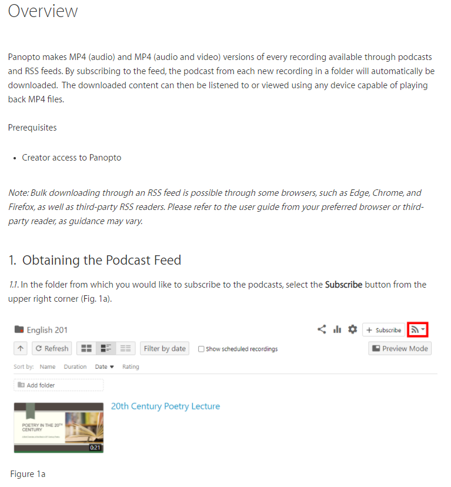
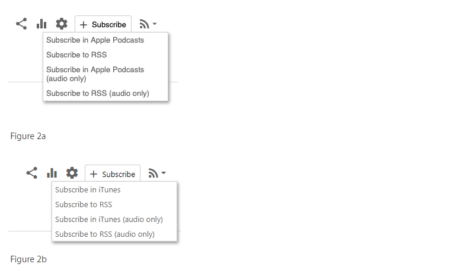

# Panopto Downloader

This repo includes `down_load.py` which can be used to download the panopto videos for a class, using the rss feed url.

## Usage

(See below for how to obtain the url)

At a high overview, get the rss url from panopto and set the url at the top of `down_load.py`.

```python
rss_url = "https://<school>.hosted.panopto.com/Panopto/Podcast/Podcast.ashx?courseid=<course_id>&type=mp4"

# used to write to xml file, so this
# should be a file_name friendly string
class_name = "cmsc___"
```

Once the correct url is set (also the class_name), run:

```shell
$ python down_load.py
```

## Installation

I recommend using [virtualenv](https://virtualenv.pypa.io/en/latest/installation.html)

```shell
$ virtualenv venv
```

```shell
# on windows
> venv\Scripts\activate

# on mac
$ source venv/bin/activate
```

```shell
$ pip install -r requirements.txt
```

## Obtaining RSS feed url

From [support.panopto.com](https://support.panopto.com/s/article/How-to-Suscribe-to-RSS-Feeds-for-MP4-Viewing)



Click "Subscribe to RSS" and copy the link


